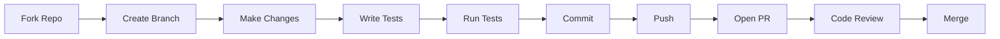

<div align="center">

# 🤝 Contributing to Nhaka 2.0

**Help us preserve cultural heritage through AI-powered document restoration**

[](http://makeapullrequest.com)
[](https://github.com/psf/black)
[](https://conventionalcommits.org)

</div>

---

## 📋 Table of Contents
- [Quick Start](#-quick-start)
- [Development Workflow](#-development-workflow)
- [Code Style](#-code-style)
- [Testing Guidelines](#-testing-guidelines)
- [Commit Messages](#-commit-messages)
- [Pull Request Process](#-pull-request-process)
- [Reporting Issues](#-reporting-issues)
- [Good First Issues](#-good-first-issues)
- [Community](#-community)

---

## 🚀 Quick Start

### Prerequisites
- Python 3.10+
- Node.js 18+
- [Novita AI API Key](https://novita.ai/dashboard/key) (free tier available)

### Setup in 2 Minutes

```bash
# 1. Fork & clone
git clone https://github.com/YOUR_USERNAME/Nhaka-2.0-Archive-Alive.git
cd Nhaka-2.0-Archive-Alive

# 2. Install dependencies
pip install -r requirements.txt
npm install

# 3. Configure environment
cp .env.example .env
# Add your NOVITA_AI_API_KEY to .env

# 4. Run tests to verify setup
pytest                    # Backend tests
npm test                  # Frontend tests

# 5. Start development servers
uvicorn main:app --reload --port 8000  # Terminal 1
npm run dev                             # Terminal 2
```

Open **http://localhost:5173** - you should see the Nhaka 2.0 landing page! 🎉

**Live Demo:** https://nhaka-20-archive-alive.vercel.app

---

## 🔄 Development Workflow



### Branching Strategy

| Branch Type | Naming | Example |
|-------------|--------|---------|
| Feature | `feature/description` | `feature/swahili-support` |
| Bug Fix | `fix/description` | `fix/confidence-calculation` |
| Documentation | `docs/description` | `docs/api-guide` |
| Testing | `test/description` | `test/linguist-agent` |

---

## 🎨 Code Style

### Python (Backend)
<p>
  
  
  
</p>

```bash
# Format code
black main.py

# Check types
mypy main.py

# Lint
flake8 main.py
```

**Requirements:**
- ✅ Type hints for all functions
- ✅ Docstrings for public APIs
- ✅ Max line length: 88 characters

### TypeScript (Frontend)
<p>
  
  
</p>

```bash
# Lint
npm run lint

# Format
npm run format
```

**Requirements:**
- ✅ Strict TypeScript mode
- ✅ No `any` types without justification
- ✅ React hooks linting enabled

---

## 🧪 Testing Guidelines

### Coverage Requirements

| Area | Minimum Coverage | Command |
|------|------------------|---------|
| **Backend** | 80% | `pytest --cov=main --cov-report=html` |
| **Frontend** | 70% | `npm run test:coverage` |

### Test Structure

```python
# Backend: pytest + Hypothesis
def test_linguist_transliteration():
    """Test Doke Shona character mapping."""
    input_text = "ɓaba"
    expected = "baba"
    result = linguist_agent.transliterate(input_text)
    assert result == expected

# Property-based testing
@given(st.text())
def test_scanner_never_crashes(text):
    """Scanner should handle any input gracefully."""
    result = scanner_agent.process(text)
    assert result is not None
```

```typescript
// Frontend: Vitest + React Testing Library
describe('AgentTheater', () => {
  it('displays all 5 agents', () => {
    render(<AgentTheater />);
    expect(screen.getByText('Scanner')).toBeInTheDocument();
    expect(screen.getByText('Linguist')).toBeInTheDocument();
    // ... etc
  });
});
```

### Running Tests

```bash
# Backend - all tests
pytest

# Backend - specific test
pytest tests/test_linguist.py -v

# Backend - with coverage
pytest --cov=main --cov-report=term-missing

# Frontend - all tests
npm test

# Frontend - watch mode
npm test -- --watch

# Frontend - coverage
npm run test:coverage
```

---

## 💬 Commit Messages

We follow [Conventional Commits](https://www.conventionalcommits.org/) for automatic changelog generation.

### Format
```
<type>(<scope>): <subject>

<body>

<footer>
```

### Types

| Type | Description | Example |
|------|-------------|---------|
| `feat` | New feature | `feat(linguist): add Swahili support` |
| `fix` | Bug fix | `fix(validator): correct confidence calculation` |
| `docs` | Documentation | `docs(readme): update installation steps` |
| `style` | Code style (formatting) | `style: format with black` |
| `refactor` | Code refactoring | `refactor(agents): extract common logic` |
| `test` | Adding tests | `test(historian): add date verification tests` |
| `chore` | Maintenance | `chore: update dependencies` |

### Examples

✅ **Good Commits:**
```
feat(linguist): add pre-1955 Doke Shona character mapping

Implements transliteration for ɓ→b, ɗ→d, ȿ→sv, ɀ→zv
based on historical orthography standards.

Closes #42
```

```
fix(scanner): handle images without text gracefully

Previously crashed on blank images. Now returns
empty result with confidence=0.

Fixes #58
```

❌ **Bad Commits:**
```
update stuff
fixed bug
WIP
more changes
```

---

## 🔀 Pull Request Process

### Before Opening a PR

- [ ] Code follows style guidelines
- [ ] Tests pass locally (`pytest && npm test`)
- [ ] Coverage meets minimums (80% backend, 70% frontend)
- [ ] Commits follow Conventional Commits format
- [ ] Documentation updated if needed

### PR Template

When opening a PR, include:

```markdown
## Description
Brief description of changes

## Type of Change
- [ ] Bug fix
- [ ] New feature
- [ ] Documentation update
- [ ] Refactoring

## Testing
How did you test this?

## Screenshots (if applicable)
Before/After comparisons

## Checklist
- [ ] Tests pass
- [ ] Code formatted
- [ ] Documentation updated
```

### Review Process

1. **Automated Checks** - CI runs tests automatically
2. **Code Review** - Maintainer reviews within 48 hours
3. **Revisions** - Address feedback with new commits
4. **Approval** - Maintainer approves and merges
5. **Celebration** - You're now a contributor! 🎉

---

## 🐛 Reporting Issues

### Bug Reports

Use the **Bug Report** template and include:

```markdown
**Describe the bug**
Clear description of what went wrong

**To Reproduce**
1. Go to '...'
2. Click on '...'
3. See error

**Expected behavior**
What should have happened

**Screenshots**
If applicable, add screenshots

**Environment**
- OS: [e.g., macOS 13.0]
- Browser: [e.g., Chrome 120]
- Python: [e.g., 3.10.5]
- Node: [e.g., 18.17.0]
```

### Feature Requests

Use the **Feature Request** template and include:

```markdown
**Problem Description**
What problem does this solve?

**Proposed Solution**
How should it work?

**Alternatives Considered**
What other approaches did you think about?

**Additional Context**
Screenshots, mockups, examples
```

---

## 🌟 Good First Issues

New to the project? Start here!

Look for issues labeled:
- 🟢 [`good first issue`](https://github.com/Peacsib/Nhaka-2.0-Archive-Alive/labels/good%20first%20issue)
- 📚 [`documentation`](https://github.com/Peacsib/Nhaka-2.0-Archive-Alive/labels/documentation)
- 🐛 [`bug`](https://github.com/Peacsib/Nhaka-2.0-Archive-Alive/labels/bug) + `easy`

### Suggested First Contributions

| Task | Difficulty | Impact |
|------|-----------|--------|
| Add language support (e.g., Swahili) | 🟢 Easy | 🔥 High |
| Improve error messages | 🟢 Easy | 🔥 Medium |
| Write tests for existing code | 🟡 Medium | 🔥 High |
| Add API documentation | 🟢 Easy | 🔥 Medium |
| Optimize image preprocessing | 🔴 Hard | 🔥 High |

---

## 💬 Community

### Get Help

- **GitHub Discussions:** [Ask questions](https://github.com/Peacsib/Nhaka-2.0-Archive-Alive/discussions)
- **Email:** peacesibx@gmail.com
- **Issues:** For bugs and feature requests

### Recognition

All contributors are recognized in our [Contributors](https://github.com/Peacsib/Nhaka-2.0-Archive-Alive/graphs/contributors) page and CHANGELOG.md!

### Code of Conduct

We follow the [Contributor Covenant](https://www.contributor-covenant.org/). Be respectful, inclusive, and collaborative.

---

<div align="center">

## 🏛️ Thank You for Helping Preserve Cultural Heritage!

**Every contribution—code, documentation, bug reports—helps save irreplaceable historical records.**

[](https://github.com/Peacsib/Nhaka-2.0-Archive-Alive/graphs/contributors)
[](https://github.com/Peacsib/Nhaka-2.0-Archive-Alive/commits/main)

**[← Back to Main README](README.md)** | **[View Architecture](ARCHITECTURE.md)**

</div>


---
